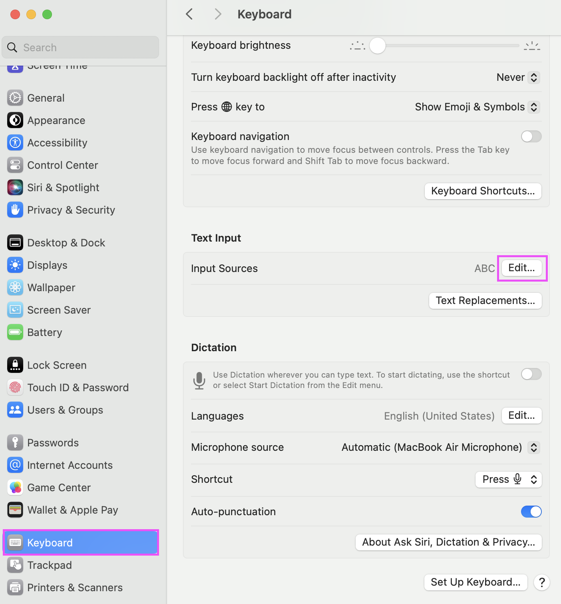
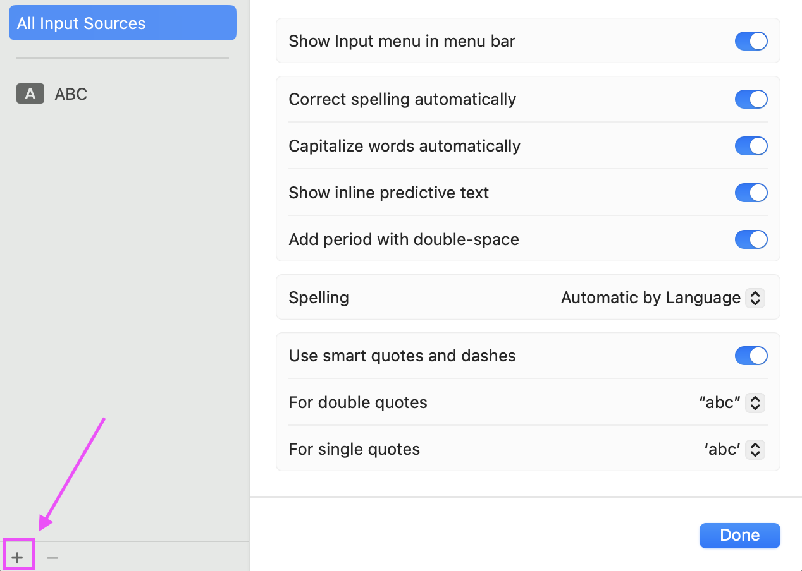
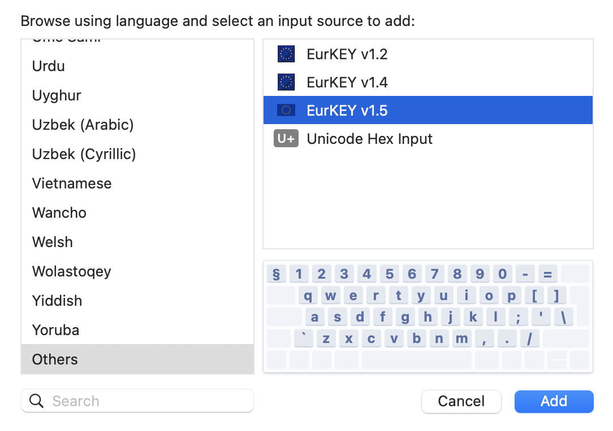
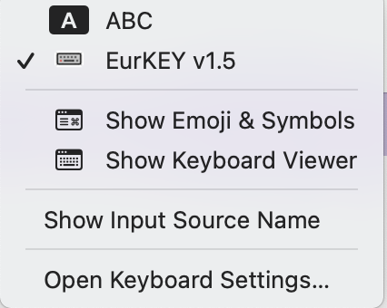

# EurKEY Next

The keyboard layout for Europeans, coders, and translators. This repo contains a **modified version** of the EurKEY base layout for macOS, bundling multiple versions so users can pick what they need.

EurKEY Next works with both ISO and ANSI keyboards. It targets the physical English International keyboard found on European MacBooks (ISO) but is fully compatible with US ANSI keyboards. The ISO key between left Shift and Z (**`§`**/**`±`**) does not exist on ANSI — these characters are accessible via the **`⌥\`** dead key: **`⌥\`** **`s`** → §, **`⌥\`** **`S`** → ±.

The keyboard layout should be compatible with the other ISO layouts typically available in Europe (e.g., German ISO). However, the printed keys will obviously be different. I tested the layout on the current tenkeyless MacBook keyboard (MacBook Air 2024). Working numpad keys are therefore not guaranteed.

## Versions

The bundle ships 4 layout versions:

| Version         | Description                                                                                                                                                                              |
| --------------- | ---------------------------------------------------------------------------------------------------------------------------------------------------------------------------------------- |
| **EurKEY Next** | Every key configures exactly as printed on the MacBook keyboard. Removes left/right modifier key distinction. Monochrome template icon. |
| **v1.4**        | v1.3 with swapped super/subscript numbers: **`⌥m`** **`1`**…**`0`** produces subscript (₁…₀), **`⌥m`** **`⇧1`**…**`⇧0`** produces superscript (¹…⁰). |
| **v1.3**        | Official EurKEY spec implementation.                                                                                                                                                     |
| **v1.2**        | Legacy version based on [Leonardo Schenkel's port](https://github.com/lbschenkel/EurKEY-Mac). Predates the v1.3 spec (no **`⌥\`** dead key, § instead of ẞ on **`⌥⇧S`**). |

## Installation

### From DMG

1. Download the latest `EurKEY-Next-YYYY.MM.DD.dmg` from [Releases](https://github.com/felixfoertsch/EurKEY-macOS/releases).
2. Open the DMG.
3. Drag `EurKEY-Next.bundle` to the `Install Here (Keyboard Layouts)` folder.
4. Log out and back in (or restart).
5. System Settings → Keyboard → Input Sources → click `+` → select EurKEY Next.

### Manual

1. Download or clone this repo.
2. Copy `EurKEY-Next.bundle` to `/Library/Keyboard Layouts/` (system-wide) or `~/Library/Keyboard Layouts/` (user-only).
3. Log out and back in.
4. System Settings → Keyboard → Input Sources → click `+` → select EurKEY Next.






## Validation

The project includes automated validation to catch regressions. The validation script parses each `.keylayout` XML file and compares key mappings and dead key compositions against the v1.3 reference.

```bash
# validate all layouts
python3 scripts/validate_layouts.py

# parse a single layout to JSON
python3 scripts/parse_keylayout.py "EurKEY-Next.bundle/Contents/Resources/EurKEY v1.3.keylayout" --summary

# build the bundle (validates + generates Info.plist)
bash scripts/build-bundle.sh

# create a DMG installer
bash scripts/build-dmg.sh
```

## Dead key compositions (EurKEY Next)

EurKEY Next renames all dead key states to their initializing key combination:

| Key combination | Dead key symbol |
| --------------- | --------------- |
| **`` ⌥` ``**    | `` ` ``         |
| **`` ⌥⇧` ``**   | ~               |
| **`⌥'`**        | ´               |
| **`⌥⇧'`**       | ¨               |
| **`⌥6`**        | ^               |
| **`⌥⇧6`**       | ˇ               |
| **`⌥7`**        | ˚               |
| **`⌥⇧7`**       | ¯               |
| **`⌥m`**        | α               |
| **`⌥⇧m`**       | 𝕄               |
| **`⌥\`**        | ¬               |

## Known issues

- **Icon not visible in keyboard switcher badge (macOS Sonoma/Sequoia):** The template icon (which adapts to light/dark mode) disappears in the input source switching badge attached to text fields. This is a macOS bug affecting third-party template icons — Apple's built-in layouts are not affected. Non-template icons work correctly but lose dark mode adaptation.

## Notes on Ukelele and template icons

Template icons switch color with the system theme (dark/light). Ukelele's GUI checkbox for template icons does not save correctly — the `TISIconIsTemplate` flag must be set manually in `Info.plist`:

```xml
<key>TISIconIsTemplate</key>
<true/>
```

The build script (`scripts/build-bundle.sh`) generates `Info.plist` with this flag set correctly for all layout versions.

## Attribution

The original EurKEY layout is by [Steffen Brüntjen](https://eurkey.steffen.bruentjen.eu/start.html). The macOS port is originally based on the work of [Leonardo Brondani Schenkel](https://github.com/lbschenkel/EurKEY-Mac).

## License

- The EurKEY Layout is licensed under [GPLv3](http://www.gnu.org/licenses/gpl-3.0.html). See: [eurkey.steffen.bruentjen.eu/license.html](https://eurkey.steffen.bruentjen.eu/license.html).
- The EU flag icon is from [Iconspedia](http://www.iconspedia.com/pack/european-flags-1631/), created by [Alpak](http://alpak.deviantart.com/) and licensed under [CC BY-NC-ND 3.0](http://creativecommons.org/licenses/by-nc-nd/3.0).
